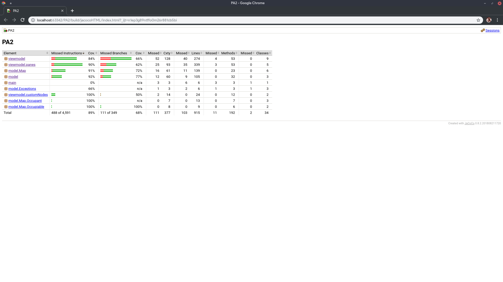

# COMP3021 PA2 Report

## Implemented Bonus Tasks

### Bonus 1: Handling `FileNotFoundException` when loading a non-existent map

- Implemented in:
  - `LevelSelectPane::setCallbacks`
  - `GameplayPane::doLoadNextLevel`
  - `GameplayPane::doRestartAction`
- Tested in:
  - `BonusTaskTest::testBonusTask1`
- Procedure to start Bonus Task:
  - Same as specified in PDF

### Bonus 2: Automating demo procedure

- Implemented in:
  - `src/test` directory
- Procedure to start Bonus Task:
  - `./gradlew check`

### Bonus 3: Reporting deadlock when one crate cannot be moved

- Implemented in:
  - `GameLevel::isDeadlocked`
  - `GameLevel::isCrateOnDestTile`
  - `GameLevel::isCrateMovable`
- Tested in:
  - `BonusTaskTest::testBonusTask3`
- Procedure to start Bonus Task:
  - Same as specified in PDF

### Bonus 4: Handling invalid maps when loading maps

- Implemented in:
  - `LevelSelectPane::setCallbacks`
  - `GameplayPane::doLoadNextLevel`
  - `GameplayPane::doRestartAction`
- Tested in:
  - `BonusTaskTest::testBonusTask4`
- Procedure to start Bonus Task:
  - Same as specified in PDF

### Bonus 5: Implementing Undo feature

- Implemented in:
  - `GameplayPane::setCallbacks`
  - `Map::History` class
  - `Map::getHistory`
- Tested in:
  - `BonusTaskTest::testBonusTask6`
- Procedure to start Bonus Task:
  - Same as specified in PDF

### Bonus 7: Update selected level after returning from `GameplayPane` to `LevelSelectPane`

- Implemented in:
  - `SceneManager::showLevelSelectMenuScene`
  - `LevelSelectPane::updateHighlightedLevel`
- Tested in:
  - `BonusTaskTest::testBonusTask7`
- Procedure to start Bonus Task:
  - Same as specified in PDF

## Other Implemented Features

### Gradle

This project uses the Gradle build system to build, test and run the application. Gradle is also used to manage my
dependencies, including Jetbrains Annotations, JUnit, and TestFX.

### Javadocs + Coverage Report

With the Gradle tasks `:javadoc` and `:jacocoTestReport`, Javadocs and a coverage report can be generated.

#### Test Report

#### Coverage Report

### Auto-Load bundled maps

In `LevelSelectPane::LevelSelectPane`, it is implemented to directly load bundled maps without user intervention, in
order to save time looking for the maps during the demo and actual gameplay.
